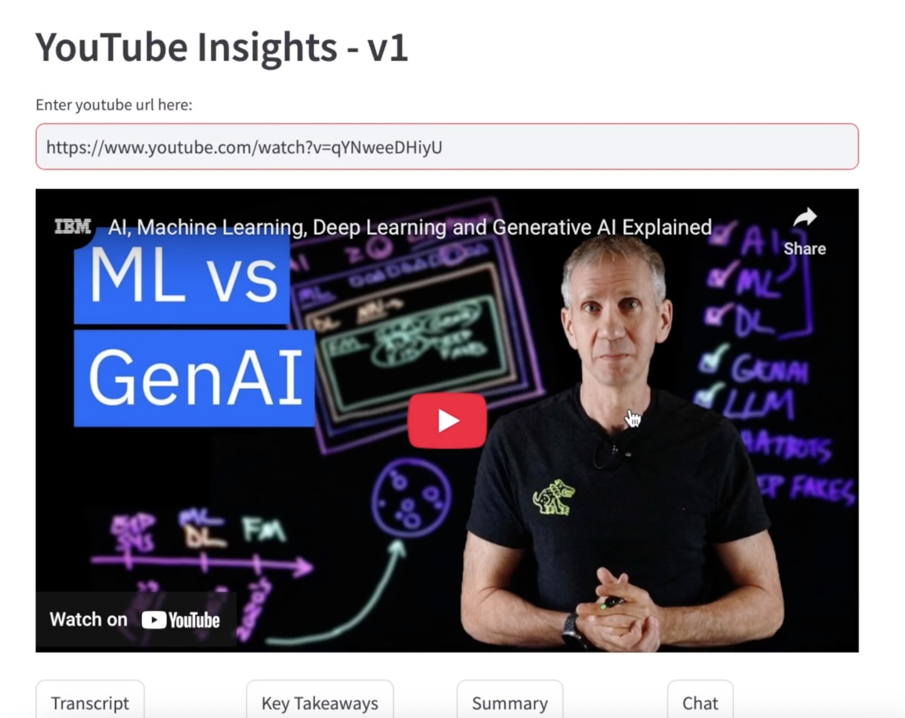

# Youtube-Insights - v1
This repo is about getting insights from YouTube videos

model used: gpt-4o-mini

There are 4 features of this app:
- Transcript: Provides raw transcript of the video
- Key Takeaways: Gives a list of key points discussed in the video, can be used as notes
- Summary: Concised summary of the video
- Chat: Interactive chat with LLM for only context discussed in the video

Run the app: streamlit run app_v1.py

Click on the thumbnail to play the demo!

